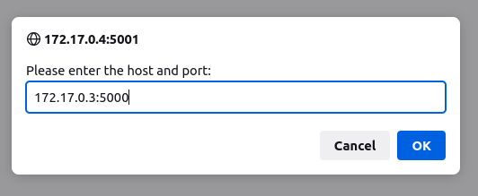

# Building and Using Defender Containers

The OCI folder contains Dockerfiles that build containerized versions of the application. This section explains how to build, start and use the containerized application.

## Building containers
In order to build the containers locally, do the following:
```
$cd defender/OCI/base
$ docker build -t defender-base .

$cd defender/OCI/server
$ docker build -t defender-server .

$ cd defender/OCI/renderer
$ docker build -t defender-render .
```
>>Note: buildah bud fails on the base container. If you prefer to use buildah, remove the digest from the `FROM` line in the base Dockerfile.

## 1) Defender Base Image
The base image has all of the requirements to run the defender components but doesn't do anything on its own. 

The other images derived from base will launch their processes automatically. To work with something manually, simply launch the base image and work from the bash shell.

Build the base image as follows:
```
$ cd OCI/base
$ docker build -t defender-base .
```

Run as follows:
```
$ docker container run --rm -it --name defender-base defender-base
```

## 2) Defender Server Image
The server image derives from base and runs the world_model REST API server on startup. 

Build the server image as follows:
```
$ cd OCI/server
$ docker build -t defender-server .
```

Run server as follows:
```
# run interactively to see logs
$ docker container run --rm -it --name defender-server defender-server

# Or, run non-interactively 
$ docker container run --rm --name defender-server defender-server
```

Determine the IP address of the server and record for later use
```
# If server was run interactive, open another shell
$ docker inspect defender-server | grep "IPAddress"
172.17.0.3  # example
```

## 3) Defender Render Image
The render image runs the renderer that displays the state of the world model in a browser. With the render container running, point browser to

[http://IPAddress:5001]

Build the server image as follows:
```
$ cd OCI/render
$ docker build -t defender-render .
```

Run as Follows:
```
# run interactively to see logs
$ docker container run --rm -it -name defender-render defender-render

# Or, run non-interactively
$ docker container run --rm -name defender-render defender-render
```

Determine the IP address of render and record for later use
```
# If render was run interactive, open another shell
$ docker inspect defender-render | grep "IPAddress"
172.17.0.4  # Example
```

## Using the containers once they're running
For the example IP addresses above (use your own IP addresses):

Point your browser at the renderer [http://172.17.0.4:5001]

On the webpage, you should see a dialog box asking for an IP:Port. Enter the IP address of the server, in this example, enter: 
```
172.17.0.3:5000
```


Note: do not include `http`, only the IP:Port of the world model server address


## Running Driver Containers
The world by itself doesn't do anything, you must run agents or drivers that interact with the REST API server. The idea is that one driver will control the behavior of one object in the world (attacker or defender)

-----

## Running Containers in Kubernetes

TBD

