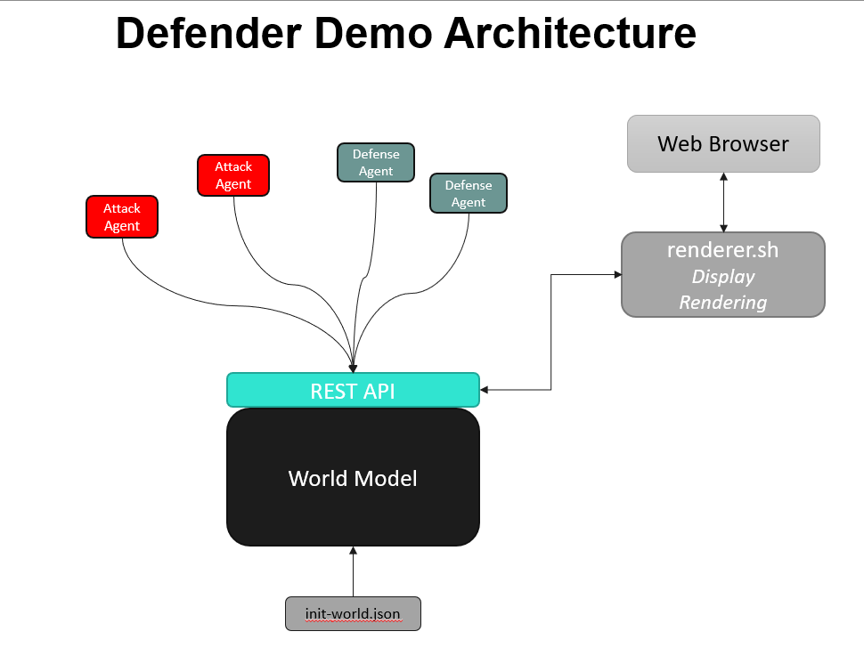

# defender
This is a simple defender game/simulation demo intended to run on kubernetes or other container-based platforms. The app is fully distributed and each component can be run in a container or on an embedded target. 

The purpose of the app is to provide something to run on k8s that's more interesting than a 'hello world' example. 





Package requirements:
```
sudo apt install python3 python3-flask python3-flask-restful
```

First start the world-model server
```
python3 world-model.py
```

Then start the renderer
```
cd renderer
 ./serve.sh 
```
and exit with Ctrl-C.  The map will be available at [http://localhost:5001/](http://localhost:5001/)

Agents are coming soon...