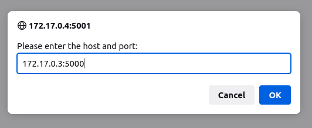

# Defender
This is a simple defender simulation demo intended to run on a container-based platform like Docker or Kubernetes. The application is fully distributed and each component can run in its own container or on an embedded target. By design, the components have no specific hardware, OS or language requirements.

The purpose of the app is to provide something to run as a demo that's more interesting than the standard 'hello world'. The point is to have distributed components interacting in a way that's easy to visualize and understand. 


The world-model is a simple database that keeps track of all objects in the simulated world. Interaction with the world-model is via a RESTful API and beyond detecting collisions between objects, the world-model doesn't actively do anything on its own. 

Rules of the simulation: attackers try to reach the target, defenders try to stop them and obstacles get in the way. If an attacker collides with the target (round flying saucer at the top in this implementation), the simulation is over. When objects collide, they die. The exception are obstacles, which survive collision. Once dead, objects don't cause further collisions.

Each object needs an agent or driver program to move it around in the world, so the intent is to have one control program per container which controls one object in the world model. In a typical video game, all of the actors would be combined for efficiency, but the goal here is to demonstrate distributed appliations interacting on an embedded, containerized or hybrid compute platform (hybrid meaning some parts running in containers, others on embedded targets).

Rendering is done in a browser where a JavaScript program reads and renders the state of the world by polling the world-model.

The scenario can easily be changed by providing a different set of sprite graphics.


Package requirements:
```
sudo apt install python3 python3-flask python3-flask-restful python3-flask-cors
```

## 1) First start the world-model server and the server address advertiser
```
$ python3 world-model.py
$ python3 server_ip_multicast.py send <rest_server_ip> <rest_server_port>

example:
    python3 server_ip_multicast.py send 10.10.11.56 5000
```
The server_ip_multicast.py can be started as a receiver to test the multicast message
```
$ python3 server_ip_multicast.py recv
```
## 2) Start the renderer
```
cd renderer
 ./serve.sh 
```
Exit with Ctrl-C.  The map will be available at [http://localhost:5001/](http://localhost:5001/)

## 3) Start the Object Drivers
Example "Driver" or agents are available in the top directory (driver-*.py). The drivers take the name of an active object as an argument and then begin to move that object around in the 2D world map. If the object collides, it will die and the driver program will exit.
```
$ python3 driver-circle.py attacker01
```
Look in `init-world.json` to see the default list of objects the world starts with, or use 
```
$ curl http://<server_ip_address>:<port>/v1/objects/
```
to get a list of all objects in the world.

------

# Running from Containers
The OCI folder contains a base image that is used to derive container images for the server (i.e. world_model.py), the renderer and the drivers.

## Building containers
In order to build the containers locally, do the following:
```
$cd OCI/base
$ docker build -t defender-base .

$cd ../OCI/server
$ docker build -t defender-server .

$ cd ../OCI/renderer
$ docker build -t defender-render .
```
Note: buildah bud fails on the base container. If you prefer to use buildah, remove the digest from the `FROM` line in the base Dockerfile.

## Running from containers in Docker
To run the containers in docker, do the following:
```
# start the world server and determine IP address
$ docker container run --rm -it -name defender-server defender-server
$ docker inspect defender-server | grep "IPAddress"
example: 172.17.0.3

# start the renderer and determine IP address
$ docker container run --rm -it -name defender-render defender-render
$ docker inspect defender-render | grep "IPAddress"
example: 172.17.0.4
```

For the example IP addresses above (use your own IP addresses):

Point your browser at the renderer [http://172.17.0.4:5001]

On the webpage, you should see a dialog box asking for an IP:Port. Enter the IP address of the server, in this example, enter: 
```
172.17.0.3:5000
```


Note: do not include `http`, only the IP:Port of the world model server address

## Running from Containers in Kubernetes

TBD

------

# REST API - rough documentation

### Get a list of objects
```
$ curl http://127.0.0.1:5000/v1/objects/
```

### Get a list of objects by type (attacker,defender,obstacle,target)
```
$ curl http://127.0.0.1:5000/v1/objects/type/defender
```

### Get a specific object by index
```
$ curl http://127.0.0.1:5000/v1/objects/3
```

### Get a specific object by name (names must be unique)
```
$ curl http://localhost:5000/v1/objects/name/attacker01
```

### Add an object with POST (name must not already exist)
```
$ curl http://localhost:5000/v1/objects/name/obstacle05 -X POST -d "name=obstacle05&x=200&y=200&ype=obstacle"
```

### Update an object's parameters with PUT (name must exist)
```
$ curl -d "x=31&y=11" -X PUT http://localhost:5000/v1/objects/name/defender02
```
Valid parameters are:
|Param Name|Note|
|----------|----|
|id       | uuid, unique
|name     | name, unique|
|type     | object type: attacker,defender,obstacle,target|
|x        | x cooridnate|
|y        | y coordinate|
|radius   | object radius|
|rotation | rotational angle, degrees|
|state    | object state: active, dead|
    
All distance parameters are in arbitrary units... adjust per the simulation scenario


### Delete an object with DELETE
```
$ curl -X DELETE http://127.0.0.1:5000/v1/objects/6
$ curl -X DELETE http://127.0.0.1:5000/v1/objects/name/attacker01
```

### Reset the world model back to contents of init-world.json
```
$ curl http://localhost:5000/v1/commands/reset -X POST
```

### Dump the world-model objects into a json file
```
$ curl http://10.10.11.56:5000/v1/commands/dump -X POST -d "filename=test01.json"
```

### get a sensor scan seen by a named object
```
$ curl http://localhost:5000/v1/sensors/name/attacker01?scanrange=200 -X GET
```